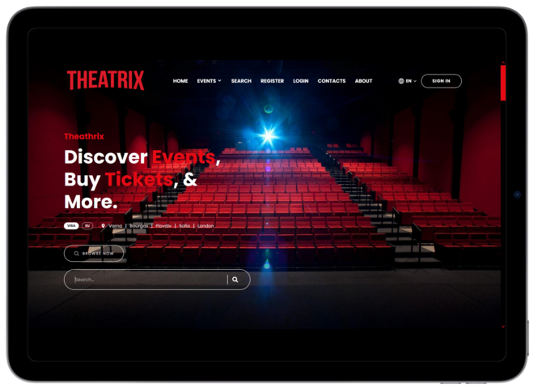
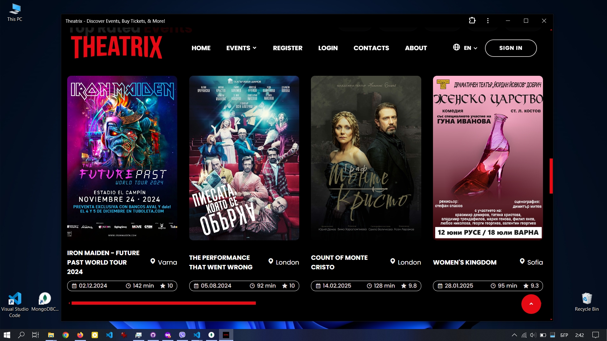
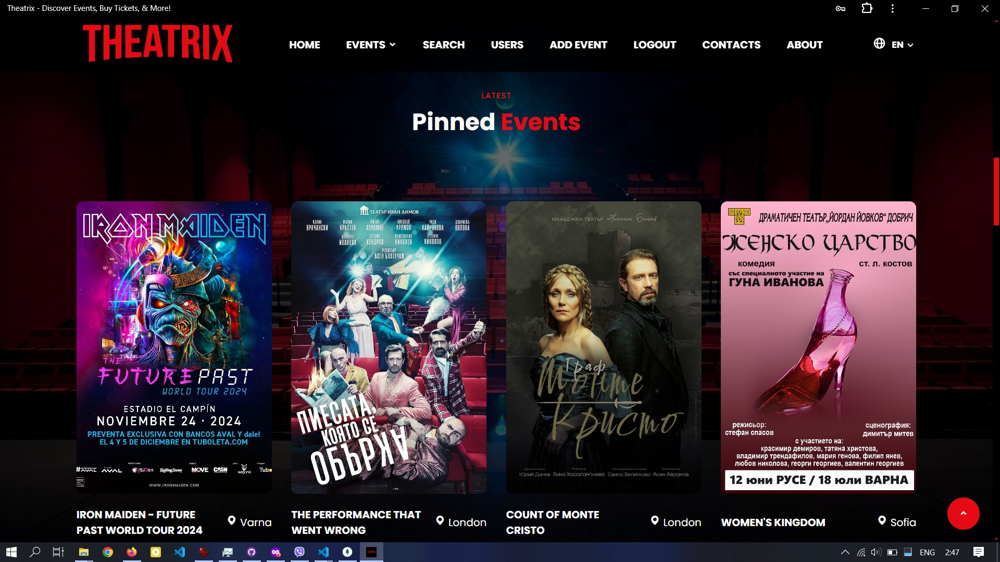
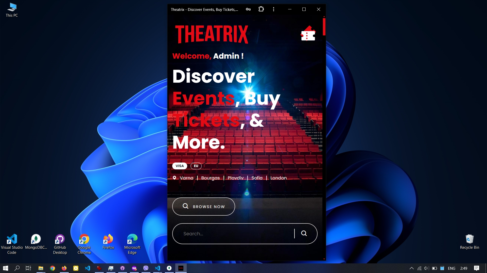

  
  
  

 
   

<h2 align="center">Theatrix - Netflix Inspired Theater And Concert Events App</h2>

  Theatrix is a Netflix inspired theater and concert event app,

  a playground project build with modern technologies

  Its using my Theatrix-HTML-template as a base

  Fully responsible, built using HTML, CSS and JavaScript.

## SCREENSHOTS

     
     
  
  

## ABOUT

**Theatrix** is a place for event holders represented as admins and customers in face of users that can interact seamlessly.. 

Theatrix as a **PWA (Progressive Web App)** can be seen in action at this address:

https://treactrix.vercel.app

## PROJECT HIGHLIGHTS

* React app + PWA (Progressive Web App)
* Personalised/User driven home page thats using registered users location
* GEO location for guest users for personalised event page even for non-registered users!
* Filter events by city on the go
* Search
* Pagination
* QR code for every event page for quick send to mobile device
* Admin system - monitoring users (registration ip, login ip, registration date, login date, LIVE ONLINE status)
* Advanced Comment system
  

## TECHNOLOGIES

### Server:

* bcrypt
* cookie-parser
* cors
* express
* jsonwebtoken
* mongodb
* mongoose

### Client:

* react 18.3.1
* js-cookie
* jwt-decode
* react-qr-code
* sweetalert2

## ACTIONS

### Administrators:

* **Event Management:** Administrators can easily create, edit, and delete events such as concerts and theater performances.
* **Highlighting Important Events:** They have the option to feature important events on the first page using a pin button.
* **Monitoring Tools:** Administrators can monitor user interactions, including tracking purchases and the number of purchases made for marketing purposes (TODO). They can also view user IP addresses during registration and last login, as well as registration and last login dates, including their city and email, for further marketing insights.

### Users:

* **Event Browsing:** Users can explore theater and concert events by category, search individually, and filter results by category, city, and year.
* **Personalized Homepage:** Upon registration, users are redirected to a user drived, personalized homepage showcasing top-rated and local theater and convert events.
* **Profile Management:** In their profile page, users can view and manage* (remove likes and buy tickets directly for liked events TODO) their liked events and track recent purchases.
* **Ticket Purchase:** Users can buy tickets directly for events they are interested in, and they can also see how many tickets are left for a particular event.

**Additional Features:**

* **QR Code Integration:** Every user, admin or guest can see in right corner of every theater or concert event page a QR Code badge that can scan and so he can quickly sent that associated event page to their mobile device like phone or tablet so they can tranfer their journey on the go quickly.
* **Geolocation Functionality (TODO/POC):** Geolocation functionality for guests allows location-based services for non-registered users and thuse enriching their experience. There is also plans for IP geolocation but its postponed as of now since mobile data isnt realiable for users location.

## HOW TO

### Server:

* npm i
* npm start

### Client:

* npm i
* npm dev start on http://192.168.56.1:5173/. To test progressive web app and geo-location you will need secure connection (https://)

## THEATRIX REST API Endpoints:

Server and client are configured to work on localhost. Server (Express REST API) is accessible from http://localhost:3000 and client (React 18.3.1) from http://192.168.56.1:5173 (default ports).

<table style="width: 804px;">
<thead>
<tr style="height: 42px;">
<th style="height: 42px; width: 151.367px;">Endpoint</th>
<th style="height: 42px; width: 18.6333px;" align="center">HTTP Method</th>
<th style="height: 42px; width: 408px;">Description</th>
<th style="height: 42px; width: 73px;" align="center">Guests Access?</th>
<th style="height: 42px; width: 74px;" align="center">Admins Access?</th>
<th style="height: 42px; width: 72px;" align="center">Users Access?</th>
</tr>
</thead>
<tbody>
<tr style="height: 212px;">
<td style="height: 212px; width: 151.367px;">/</td>
<td style="height: 212px; width: 18.6333px;" align="center">GET</td>
<td style="height: 212px; width: 408px;">

Retrieves Pinned/Important Events (put by admins) latest Theater Events, latest Concert Events, All Time Top Rated Events***

 

*** Accessed by logged-in users, becomes strongly personalised page. It displays theater events, concerts and top rated events based on users location (using city from registration, TODO for not-logged using geo-location)

</td>
<td style="height: 212px; width: 73px;" align="center">✔️</td>
<td style="height: 212px; width: 74px;" align="center">✔️</td>
<td style="height: 212px; width: 72px;" align="center">✔️</td>
</tr>
<tr style="height: 22px;">
<td style="height: 22px; width: 151.367px;">/search</td>
<td style="height: 22px; width: 18.6333px;" align="center">GET</td>
<td style="height: 22px; width: 408px;">Retrieves all events by default</td>
<td style="height: 22px; width: 73px;" align="center">❌</td>
<td style="height: 22px; width: 74px;" align="center">✔️</td>
<td style="height: 22px; width: 72px;" align="center">✔️</td>
</tr>
<tr style="height: 49px;">
<td style="height: 49px; width: 151.367px;">/search</td>
<td style="height: 49px; width: 18.6333px;" align="center">POST</td>
<td style="height: 49px; width: 408px;">Retrieves search results initialised from user by name, category, year or event type</td>
<td style="height: 49px; width: 73px;" align="center">❌</td>
<td style="height: 49px; width: 74px;" align="center">✔️</td>
<td style="height: 49px; width: 72px;" align="center">✔️</td>
</tr>
<tr style="height: 22px;">
<td style="height: 22px; width: 151.367px;">/contacts</td>
<td style="height: 22px; width: 18.6333px;" align="center">GET</td>
<td style="height: 22px; width: 408px;">Retrieves contacts page</td>
<td style="height: 22px; width: 73px;" align="center">✔️</td>
<td style="height: 22px; width: 74px;" align="center">✔️</td>
<td style="height: 22px; width: 72px;" align="center">✔️</td>
</tr>
<tr style="height: 22px;">
<td style="height: 22px; width: 151.367px;">/about</td>
<td style="height: 22px; width: 18.6333px;" align="center">GET</td>
<td style="height: 22px; width: 408px;">Retrieves about page</td>
<td style="height: 22px; width: 73px;" align="center">✔️</td>
<td style="height: 22px; width: 74px;" align="center">✔️</td>
<td style="height: 22px; width: 72px;" align="center">✔️</td>
</tr>
<tr style="height: 22px;">
<td style="height: 22px; width: 151.367px;">/profile</td>
<td style="height: 22px; width: 18.6333px;" align="center">GET</td>
<td style="height: 22px; width: 408px;">Retrieves all events that user purchased or liked in form of visual representation</td>
<td style="height: 22px; width: 73px;" align="center">❌</td>
<td style="height: 22px; width: 74px;" align="center">❌</td>
<td style="height: 22px; width: 72px;" align="center">✔️</td>
</tr>
<tr style="height: 22px;">
<td style="height: 22px; width: 151.367px;">/users</td>
<td style="height: 22px; width: 18.6333px;" align="center">GET</td>
<td style="height: 22px; width: 408px;">Retrieves all users with information about their _id, username, email, city, registration ip address, last login ip address, registration date and last login date</td>
<td style="height: 22px; width: 73px;" align="center">❌</td>
<td style="height: 22px; width: 74px;" align="center">✔️</td>
<td style="height: 22px; width: 72px;" align="center">❌</td>
</tr>
<tr style="height: 22px; background-color: red;">
<td style="height: 22px; width: 151.367px;">                 T</td>
<td style="height: 22px; width: 18.6333px;" align="center">H</td>
<td style="height: 22px; width: 408px;">              E               A                 T</td>
<td style="height: 22px; width: 73px;" align="center">R</td>
<td style="height: 22px; width: 74px;" align="center">I</td>
<td style="height: 22px; width: 72px;" align="center">X</td>
</tr>
<tr style="height: 42px;">
<td style="height: 42px; width: 151.367px;">/events/</td>
<td style="height: 42px; width: 18.6333px;" align="center">GET</td>
<td style="height: 42px; width: 408px;">Retrieves all theater and concert events</td>
<td style="height: 42px; width: 73px;" align="center">✔️</td>
<td style="height: 42px; width: 74px;" align="center">✔️</td>
<td style="height: 42px; width: 72px;" align="center">✔️</td>
</tr>
<tr style="height: 42px;">
<td style="height: 42px; width: 151.367px;">/events/theater</td>
<td style="height: 42px; width: 18.6333px;" align="center">GET</td>
<td style="height: 42px; width: 408px;">Retrieves all theater events</td>
<td style="height: 42px; width: 73px;" align="center">✔️</td>
<td style="height: 42px; width: 74px;" align="center">✔️</td>
<td style="height: 42px; width: 72px;" align="center">✔️</td>
</tr>
<tr style="height: 22px;">
<td style="height: 22px; width: 151.367px;">/events/concerts</td>
<td style="height: 22px; width: 18.6333px;" align="center">GET</td>
<td style="height: 22px; width: 408px;">Retrieves all concert events</td>
<td style="height: 22px; width: 73px;" align="center">✔️</td>
<td style="height: 22px; width: 74px;" align="center">✔️</td>
<td style="height: 22px; width: 72px;" align="center">✔️</td>
</tr>
<tr style="height: 22px;">
<td style="height: 22px; width: 151.367px;">/events/add</td>
<td style="height: 22px; width: 18.6333px;" align="center">GET</td>
<td style="height: 22px; width: 408px;">Retrieves form for registering/adding new event</td>
<td style="height: 22px; width: 73px;" align="center">❌</td>
<td style="height: 22px; width: 74px;" align="center">✔️</td>
<td style="height: 22px; width: 72px;" align="center">❌</td>
</tr>
<tr style="height: 22px;">
<td style="height: 22px; width: 151.367px;">/events/add</td>
<td style="height: 22px; width: 18.6333px;" align="center">POST</td>
<td style="height: 22px; width: 408px;">Adds/Creates new event</td>
<td style="height: 22px; width: 73px;" align="center">❌</td>
<td style="height: 22px; width: 74px;" align="center">✔️</td>
<td style="height: 22px; width: 72px;" align="center">❌</td>
</tr>
<tr style="height: 22px;">
<td style="height: 22px; width: 151.367px;">/events/:eventId</td>
<td style="height: 22px; width: 18.6333px;" align="center">GET</td>
<td style="height: 22px; width: 408px;">Retrieves details page for associated event</td>
<td style="height: 22px; width: 73px;" align="center">✔️</td>
<td style="height: 22px; width: 74px;" align="center">✔️</td>
<td style="height: 22px; width: 72px;" align="center">✔️</td>
</tr>
<tr style="height: 22px;">
<td style="height: 22px; width: 151.367px;">/events/:eventId</td>
<td style="height: 22px; width: 18.6333px;" align="center">PUT</td>
<td style="height: 22px; width: 408px;">Retrieves form for editing associated event</td>
<td style="height: 22px; width: 73px;" align="center">❌</td>
<td style="height: 22px; width: 74px;" align="center">✔️</td>
<td style="height: 22px; width: 72px;" align="center">❌</td>
</tr>
<tr style="height: 22px;">
<td style="height: 22px; width: 151.367px;">/events/:eventId</td>
<td style="height: 22px; width: 18.6333px;" align="center">DELETE</td>
<td style="height: 22px; width: 408px;">Removes/Deletes associated event</td>
<td style="height: 22px; width: 73px;" align="center">❌</td>
<td style="height: 22px; width: 74px;" align="center">✔️</td>
<td style="height: 22px; width: 72px;" align="center">❌</td>
</tr>
<tr style="height: 22px;">
<td style="height: 22px; width: 151.367px;">/events/:eventId/like</td>
<td style="height: 22px; width: 18.6333px;" align="center">POST</td>
<td style="height: 22px; width: 408px;">Performs like action, increases event and user likes +1, retrieves total likes</td>
<td style="height: 22px; width: 73px;" align="center">❌</td>
<td style="height: 22px; width: 74px;" align="center">❌</td>
<td style="height: 22px; width: 72px;" align="center">✔️</td>
</tr>
<tr style="height: 22px;">
<td style="height: 22px; width: 151.367px;">/events/:eventId/unlike</td>
<td style="height: 22px; width: 18.6333px;" align="center">POST</td>
<td style="height: 22px; width: 408px;">Removes like action, descreases event and user likes -1, hides total likes</td>
<td style="height: 22px; width: 73px;" align="center">❌</td>
<td style="height: 22px; width: 74px;" align="center">❌</td>
<td style="height: 22px; width: 72px;" align="center">✔️</td>
</tr>
<tr style="height: 42px;">
<td style="height: 42px; width: 151.367px;">/events/:eventId/pin</td>
<td style="height: 42px; width: 18.6333px;" align="center">POST</td>
<td style="height: 42px; width: 408px;">Adds associated event _id to pinned array (adds event to home page in Pinned Events section)</td>
<td style="height: 42px; width: 73px;" align="center">❌</td>
<td style="height: 42px; width: 74px;" align="center">✔️</td>
<td style="height: 42px; width: 72px;" align="center">❌</td>
</tr>
<tr style="height: 22px;">
<td style="height: 22px; width: 151.367px;">/events/:eventId/unpin</td>
<td style="height: 22px; width: 18.6333px;" align="center">POST</td>
<td style="height: 22px; width: 408px;">Removes associated event _id from pinned array (removes event from home page Pinned Events section)</td>
<td style="height: 22px; width: 73px;" align="center">❌</td>
<td style="height: 22px; width: 74px;" align="center">✔️</td>
<td style="height: 22px; width: 72px;" align="center">❌</td>
</tr>
<tr style="height: 22px;">
<td style="height: 22px; width: 151.367px;">/events/:eventId/buy</td>
<td style="height: 22px; width: 18.6333px;" align="center">POST</td>
<td style="height: 22px; width: 408px;">Adds associated event _id to bought and owner array, decreases tickets count -1. (User buys ticket for associated event, increases user's bought list +1, decreases event total tickets -1</td>
<td style="height: 22px; width: 73px;" align="center">❌</td>
<td style="height: 22px; width: 74px;" align="center">❌</td>
<td style="height: 22px; width: 72px;" align="center">✔️</td>
</tr>
<tr style="height: 22px;">
<td style="height: 22px; width: 151.367px;">/events/user</td>
<td style="height: 22px; width: 18.6333px;" align="center">GET</td>
<td style="height: 22px; width: 408px;">Endpoint for geo-location api WIP</td>
<td style="height: 22px; width: 73px;" align="center"><strong>-</strong></td>
<td style="height: 22px; width: 74px;" align="center"><strong>-</strong></td>
<td style="height: 22px; width: 72px;" align="center"><strong>-</strong></td>
</tr>
<tr style="height: 22px; background-color: red;">
<td style="height: 22px; width: 151.367px;">                 T</td>
<td style="height: 22px; width: 18.6333px;" align="center">H</td>
<td style="height: 22px; width: 408px;">            E               A                 T</td>
<td style="height: 22px; width: 73px;" align="center">R</td>
<td style="height: 22px; width: 74px;" align="center">I</td>
<td style="height: 22px; width: 72px;" align="center">X</td>
</tr>
<tr style="height: 42px;">
<td style="height: 42px; width: 151.367px;">/auth/register</td>
<td style="height: 42px; width: 18.6333px;" align="center">POST</td>
<td style="height: 42px; width: 408px;">

Registers new member, with associated role "user" or "admin" ***, gets registration date, ip address and role, sends cookie with token and associated role, username, email and city to member's browser.

*** for Admin registration, refer to server config and add your ip address in section [ ADMIN_IP_ADDRESS = " " ]

</td>
<td style="height: 42px; width: 73px;" align="center">✔️</td>
<td style="height: 42px; width: 74px;" align="center">❌</td>
<td style="height: 42px; width: 72px;" align="center">❌</td>
</tr>
<tr style="height: 42px;">
<td style="height: 42px; width: 151.367px;">/auth/login</td>
<td style="height: 42px; width: 18.6333px;" align="center">POST</td>
<td style="height: 42px; width: 408px;">Authorizes already registered user or admin, updates last login ip address and last login date on db, sends cookie with token and associated role, username, email and city to member's browser. </td>
<td style="height: 42px; width: 73px;" align="center">✔️</td>
<td style="height: 42px; width: 74px;" align="center">❌</td>
<td style="height: 42px; width: 72px;" align="center">❌</td>
</tr>
<tr style="height: 42px;">
<td style="height: 42px; width: 151.367px;">/auth/logout</td>
<td style="height: 42px; width: 18.6333px;" align="center">GET</td>
<td style="height: 42px; width: 408px;">Removes authorization of registered user or admin (deletes cookie on member's browser)</td>
<td style="height: 42px; width: 73px;" align="center">✔️</td>
<td style="height: 42px; width: 74px;" align="center">❌</td>
<td style="height: 42px; width: 72px;" align="center">❌</td>
</tr>
</tbody>
</table>

 

 

 

 

## THEATRIX - AS PWA PROGRESSIVE WEB APP - SCREENSHOTS

     
     
  
  

